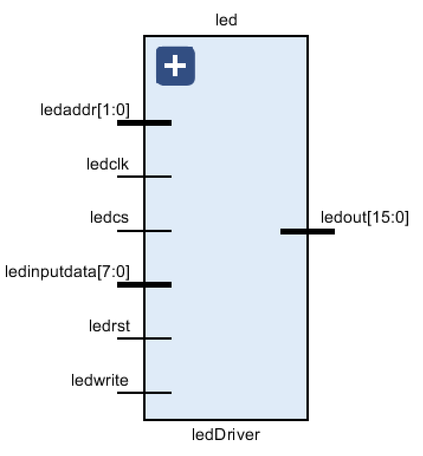

# 2023 Computer Organization Project Report

## Developer's instructions

|      Name      |    SID     | Contribution ratio |                        Work                         |
| :------------: | :--------: | :----------------: | :-------------------------------------------------: |
| Ruixiang Jiang | $12111611$ |       $33\%$       | ALU, IFetch, CPUTop, Led, Switch, Seg, Uart, Report |
|  Yujing Zhang  | $12111944$ |       $33\%$       |        Dmemory, MemOrIO, CPUTop, Led, Switch        |
|   Yilun Qiu    | $12013006$ |       $33\%$       |      Assembly files, Decoder, Controller, Uart      |

## Version modification record

-   v$1.0$ (05-14): Basic modules completed
-   v$1.1$ (05-20): Top module completed
-   v$1.2$ (05-21): Uart completed
-   Final Version v$1.3$(05-23): Assembly part completed

## CPU architecture design specification

- **CPU Features**

  - Instruction Set Architecture
    Registers: number = $32$, width = $32$ bits
    Instruction set: Basic Minisys + mul + mult + div + divu + mfhi + mflo
    

  - Address Space Design

    - Architecture: Harvard architecture, instruction memory is stored separately from data memory
    - Addressing unit: Byte
    - Instruction space: $0x00000000$ ~ $0xFFFFFFFF$
    - Data space: $0x00000000$ ~ $0xFFFFFC00$

  - External I/O Devices: Accessing I/O using polling

    |    Device    |   Address    |
    | :----------: | :----------: |
    |   Left LED   | $0xFFFFFC62$ |
    |  Right LED   | $0xFFFFFC60$ |
    | Left Switch  | $0xFFFFFC72$ |
    | Right Switch | $0xFFFFFC70$ |
    | Enter Button | $0xFFFFFC73$ |
    |   Segment    | $0xFFFFFC80$ |

  - CPI: single cycle CPU

  - CPU Frequency: 10MHz

- **CPU interface**

  -   Clock: Built-in clock interface of EGO1 development board
  -   Reset: R1 of EGO1 development board
  -   Uart: Use Uart IP core
  -   Switch: Left switches for input data, and right switches for input instruction
  -   16-bit-width Led: Output result in a binary number
  -   8-bit-width Seg: Output arithmetic result with max value = $99999999$

- **Internal Structure of CPU**

  -   Interface Connections among Submodules within CPU

      

      **HD Figure: https://ooad-1312953997.cos.ap-guangzhou.myqcloud.com/cpu/overall1.pdf**

      **Note: generated from VIVADO RTL analysis.**

      

      **HD Figure: https://ooad-1312953997.cos.ap-guangzhou.myqcloud.com/cpu/overall2.png**

      **Note: use the tool developed by SE Group.2339, Github URL: https://github.com/sustech-cs304/team-project-2339**

- Submodules

- Instruction Fetcher (Ifetch32)
  The instruction fetch stage involves retrieving the instruction from the memory. The program counter (PC) is responsible for providing the memory address of the current instruction. This address is sent to the instruction memory, which fetches the instruction stored at that address and transfers it to the instruction register (IR). Additionally, the program counter is incremented to point to the subsequent instruction in memory.
  

- Decoder (decode32)
  It performs as an instruction decoder stage, the received instruction is analyzed and decoded. The control unit examines the opcode of the instruction and determines the required control signals for subsequent stages. By interpreting the opcode, the control unit configures the CPU components accordingly, enabling the appropriate data paths and control signals necessary for executing the instruction.
  

- ALU (executs32)
  The ALU carries out arithmetic and logical operations on the data within the CPU. Depending on the specific instruction, the ALU performs operations such as addition, subtraction, logical AND, logical OR, and other specified computations. The ALU takes inputs from the general-purpose registers and applies the operation indicated by the control signals received from the control unit.
  

- Controller (control32)
  The controller is responsible for generating the required control signals to coordinate the activities of the CPU components. It examines the decoded instruction and produces control signals to enable or disable specific registers, select the appropriate source and destination registers, activate the ALU, and govern memory operations. The controller plays a crucial role in orchestrating the overall execution of the instruction.
  

- Data Memory (dmemory32)
  The data memory stage involves accessing the memory unit for reading and writing operations. The data memory unit reads data from the specified address (in the case of a load operation) or writes data to the specified address (in the case of a store operation). Here we use an IP core to simulate RAM.
  

    -   MemOrIO (MemOrIO)
        During the MemOrIO stage, the CPU interacts with external memory or I/O devices to either read data from memory or write data to memory or I/O devices. This stage involves transferring data between the CPU and the memory or I/O devices, as well as handling any necessary address calculations or data transfers.
        It contains the following operations:
        -   Memory Read: If the instruction requires reading data from memory, the memory address calculated in earlier stages (typically stored in the Memory Address Register, MAR) is used to fetch the data from the memory. The fetched data is then temporarily stored in the Memory Data Register (MDR) within the CPU.
        -   Memory Write: If the instruction involves writing data to memory, the memory address and data to be written (typically stored in the MAR and MDR, respectively) are transferred from the CPU to the memory. The memory then stores the data at the specified memory address.
        -   I/O Operations: In some cases, the MemOrIO stage can involve input/output operations instead of or in addition to memory operations. This includes communication with peripheral devices such as keyboards, displays, or storage devices. The CPU may send or receive data to or from these devices during this stage.

        The specific operations and data transfers during the MemOrIO stage depend on the instruction being executed and the specific design of the CPU. The MemOrIO stage is an integral part of the single-cycle CPU architecture, ensuring that memory and I/O operations are properly handled within the CPU's instruction execution process.

​    

    -   Switch Driver (Switch)
        The switches on the EGO1 development board can be toggled on or off to provide input signals to the board. The switch driver module would typically include the necessary circuitry and logic to read the state of the switches and provide the corresponding digital signals to the other components or modules on the board.

        The switch driver module enables the EGO1 board to read the status of the switches and use that information for various purposes, such as what we need to do in the basic test.

​    


    -   LED Driver (ledDriver)
        The LED driver is an essential module responsible for controlling the LEDs (Light Emitting Diodes) on the board. Receiving input signals from various sources, such as the microcontroller or other modules on the board, it provides the necessary circuitry and logic to control the illumination of the LEDs based on the desired patterns or states, typically including the LED patterns, sequences, or behaviors.

        With the LED driver module, the EGO1 development board can effectively control the illumination and behavior of the LEDs, providing visual feedback or indicators for various purposes, such as status indication, user interaction, and debugging information.

​    

    -   Segment Driver (segDriver)
        The segment driver is responsible for controlling the seven-segment digital tube used to display numbers. It takes input signals, such as digital data representing numbers to be displayed, and generates the appropriate signals to activate the specific segments required to form the desired pattern.

        By controlling the activation and deactivation of the tubes, the seg driver module enables the EGO1 board to display numbers or characters on the 7-segment display. It can be programmed or configured to update the display in real-time, showing dynamic information, or to show static values based on the input provided.

        Special attention should be paid to the value of the clock cycle for the 7-segment display on the EGO1 development board.

​    


## Test instructions

- Test for Verilog

  |   Method   |  Type  |                         Detail                         |  Result  |
  | :--------: | :----: | :----------------------------------------------------: | :------: |
  | Simulation |  Unit  | Test the $5$ basic modules on OJ http://172.18.34.109/ | Accepted |
  | Synthesis  | Module |    Test whether the modules are sussessfully mixed     | Accepted |

- Test for MIPS

  |             Detail              |  Result  |
  | :-----------------------------: | :------: |
  |      Test waterfall lights      | Accepted |
  | Test single R-type instructions | Accepted |
  | Test single I-type instructions | Accepted |
  | Test single J-type instructions | Accepted |
  |          Test scene 1           | Accepted |
  |          Test scene 2           | Accepted |

  - Test Scene 1

  | Scenario 1. Testcase ID | Testcase Description                                         | Result   |
  | ----------------------- | ------------------------------------------------------------ | -------- |
  | 3'b000                  | Enter the test number **a**, display **a** on the LED light. At the same time, use one LED light to determine **whether a is a power of two** (e.g. 8'h01 and 8'h10 are powers of two, the LED light is on. 8'ha0 and 8'h0a are not powers of two, the LED light is not on) | Accepted |
  | 3'b001                  | Input the test number **a**, display **a** on the output device. At the same time, use one LED light to display **whether a is an odd number**(e.g, 8'h01 and 8'hab are odd numbers, the LED light will be on. 8'ha0 and 8'hbc are not odd numbers, the LED light is not on) | Accepted |
  | 3'b010                  | Execute testcase 3'b111 first, then calculate the bitwise **OR** operation of **a** and **b**, and display the results on the output device | Accepted |
  | 3'b011                  | Execute testcase 3'b111 first, then calculate the bitwise **NOR** operation of **a** and **b**, and display the results on the output device | Accepted |
  | 3'b100                  | Execute test case 3'b111 first, then calculate the bitwise **XOR** operation of **a** and **b**, and display the results on the output device | Accepted |
  | 3'b101                  | First execute test case 3'b111, then execute the **SLT** instruction, **compare a and b as signed numbers**, and use the output device to demonstrate whether the relationship between a and b is valid.(Relationship established, light on, relationship not established, light off) | Accepted |
  | 3'b110                  | First execute test case 3'b111, then execute the **SLTU** instruction, **compare a and b as unsigned numbers**, and use the output device to demonstrate whether the relationship between a and b is valid(Relationship established, light on, relationship not established, light off) | Accepted |
  | 3'b111                  | Input test number a, input test number b, and display the values of a and b on the output device | Accepted |

  - Test Scene 2

  | Scenario 2. Testcase ID | Testcase Description                                         | Result   |
  | ----------------------- | ------------------------------------------------------------ | -------- |
  | 3'b000                  | Enter the numerical value of **a** (**a is considered a signed number**), **calculate the cumulative sum of 1 to a,** and display the cumulative sum on the output device **(if a is a negative number, give a blinking prompt**) | Accepted |
  | 3'b001                  | Enter the numerical value of **a (a is considered an unsigned number), recursively calculate the sum of 1 to a**, record the number of times the stack was pushed and pushed, and **display the sum of the times the stack was pushed and popped on the output device** | Accepted |
  | 3'b010                  | Enter the numerical value of **a (a is considered an unsigned number)**, **recursively calculate the sum of 1 to a,** record the data of stack entry and exit, and **display the parameters which is pushed to the stack on the output device**. **Each parameter of the stack is displayed for 2-3 seconds** (indicating that the output here does not pay attention to the stack entry and exit information of $ra) | Accepted |
  | 3'b011                  | Enter the numerical value of **a (a is considered an unsigned number)**, **recursively calculate the sum of 1 to a,** record the data of stack entry and exit, and **display the parameters which is popped from the stack on the output device**. **Each parameter of the stack is displayed for 2-3** **seconds** (indicating that the output here does not pay attention to the stack entry and exit information of $ra) | Accepted |
  | 3'b100                  | Input test number **a** and test number **b** to implement the **addition of signed numbers** (**a, b, and the sum of additions are all 8 bits, where the** **highest bit is considered the sign bit. If the sign bit is 1, it represents the 2’s complement of the negative number**), and determine whether overflow occurs. **Output the operation result and overflow judgment** | Accepted |
  | 3'b101                  | Input test number **a** and test number **b** to **subtract signed numbers** (**a, b, and the difference are all 8 bits, where the highest bit is considered as** **the sign bit. If the sign bit is 1, it represents the 2’s complement of the negative number**), and determine whether overflow occurs. Output the operation result and overflow judgment | Accepted |
  | 3'b110                  | Input test number **a** and test number **b** to implement **the multiplication of signed numbers (a and b are both 8 bits, the product is 16 bits, and** **the highest bit is considered as the sign bit. If the sign bit is 1, it represents the 2’s complement of the negative number)**, and **output the** **product** | Accepted |
  | 3'b111                  | Input test number **a** and test number **b** to achieve **division of signed numbers (a, b, quotient and remainder are both 8 bits, where the highest** **bit is considered the sign bit. If the sign bit is 1, it represents the complement of the negative number**), and **output quotient and remainder** **(quotient and remainder are displayed alternately, each lasting for 5 seconds)** | Accepted |

- **Summary**: We have passed all tests for both Verilog and MIPS, our CPU and assembly files are correct.

## Bonus Part

### Function

#### Implement the Uart Interface

We have completed the uart function based on the lab slides (lab13).
**CPU_TOP.v :** add inputs and outputs definition as well.

```verilog
// Uart
wire[15:0] uartData;
wire upgclk;
wire upgclk_o;
wire upg_wen_o;
wire upg_done_o; // iFpgaUartFromPC finish
wire[14:0] upg_adr_o; // data to which memory unit of rom/dmemory
wire[31:0] upg_dat_o; // data to rom or Dmemory
wire spg_bufg;
BUFG U1(.I(start_pg), .O(spg_bufg)); // de-twitter
reg upg_rst = 1; // generate uart rst signal
always @(posedge clock) begin
    if (spg_bufg) upg_rst = 0;
    if (rst) upg_rst = 1;
end
wire not_uart_rst = rst | (!upg_rst);
// CPU works on normal/uart mode when kickOff = 1/0
uart_bmpg_0 uart  (.upg_adr_o(upg_adr_o),
       .upg_clk_i(upgclk),
       .upg_clk_o(upgclk_o),
       .upg_dat_o(upg_dat_o),
       .upg_done_o(upg_done_o),
       .upg_rst_i(upg_rst),
       .upg_rx_i(rx),
       .upg_tx_o(tx),
       .upg_wen_o(upg_wen_o));

clk_wiz_0 clk_instance(
    .clk_in1(clock),
    .clk_out1(cpu_clk),
    .clk_out2(upgclk)
);
```

**dmemory.v :** add inputs and outputs definition as well.

```verilog
module dmemory32(ram_clk_i, ram_wen_i, ram_adr_i, ram_dat_i, ram_dat_o,
                upg_rst_i, upg_clk_i, upg_wen_i, upg_adr_i, upg_dat_i, upg_done_i);

    input ram_clk_i;
    input ram_wen_i;
    input [13:0] ram_adr_i;
    input [31:0] ram_dat_i;
    output [31:0] ram_dat_o;
    input upg_rst_i;
    input upg_clk_i;
    input upg_wen_i;
    input [13:0] upg_adr_i;
    input [31:0] upg_dat_i;
    input upg_done_i;

    wire ram_clk = !ram_clk_i;

    wire kickOff = upg_rst_i | (~upg_rst_i & upg_done_i);

    // ram
    RAM ram(
        .clka (kickOff? ram_clk:upg_clk_i),
        .wea (kickOff? ram_wen_i:upg_wen_i),
        .addra (kickOff? ram_adr_i:upg_adr_i),
        .dina (kickOff? ram_dat_i:upg_dat_i),
        .douta (ram_dat_o)
    );

endmodule
```

#### Extended instruction type

We implement 6 extension instructions:  `mult`,`multu`,`div`,`divu`,`mflo`,`mfhi`

#### Thoughts:

To implement these instructions, we need to use two extra registers `hi` register and `lo` register to store the result of the instructions. In such case, we need to add codes in the ALU module to support multiplication and division. Meanwhile, in the Decoder modulem, we need to initialize `hi` and `lo` registers and consider when and how to write the corresponding registers.

##### Codes:

- ALU (executs32): 
  We need `hi` and `lo` registers as the output of the module.

```verilog
output reg[31:0] hi,
output reg[31:0] lo
```

We add a piece of combinational logic codes to get the results of `hi` and `lo` registers. Such codes can get correct results of the extended instructions.

```verilog
always @(*) begin
    if (Exe_opcode == 6'b000000) begin
        case (Function_opcode)
            6'b01_1000: {hi, lo} = $signed(Ainput) * $signed(Binput); // mult
            6'b01_1001: {hi, lo} = Ainput * Binput; // multu
            6'b01_1010: begin // div
                lo = $signed(Ainput) / $signed(Binput);
                hi = $signed(Ainput) % $signed(Binput);
            end
            6'b01_1011: begin // divu
                lo = Ainput / Binput;
                hi = Ainput % Binput;
            end
            default: {hi, lo} = 64'b0;
        endcase
    end
    else {hi, lo} = 64'b0;
end
```

- Decoder (decode32)
  We need `hi_from_ALU` and `lo_from_ALU` as the input of the module. These registers are passed from the ALU mudole.

```verilog
input [31:0] hi_from_ALU; // the hi register result from ALU
input [31:0] lo_from_ALU; // the lo register result from ALU
```

We need to judge whether to use the result of `hi` register and `lo` register, and we need to judge whether the instruction is `mflo` or `mfhi`.

```verilog
wire hi_lo_calculate = Instruction[31:26] == 6'b000000 &&
    (Instruction[5:0] == 6'b011000 ||
     Instruction[5:0] == 6'b011001 ||
     Instruction[5:0] == 6'b011010 ||
     Instruction[5:0] == 6'b011011); // judge whether the instruction needs hi/lo
wire mflo = (Instruction[31:26] == 6'b000000 && Instruction[5:0] == 6'b010010)? 1'b1: 1'b0; // judge whether the instruction is mflo
wire mfhi = (Instruction[31:26] == 6'b000000 && Instruction[5:0] == 6'b010000)? 1'b1: 1'b0; // judge whether the instruction is mfhi
```

We add a piece of combinational logic codes in the decoder module. Such codes are required to initialize the `hi` and `lo` registers and move the values of `hi` and `lo` registers to the specific registers.

```verilog
    integer i;
    always @(posedge clock) begin
        if (reset) begin
            for (i = 0;i < 32;i = i + 1) registers[i] <= 32'b0; // initialize registers
            hi <= 32'b0; // initialize hi
            lo <= 32'b0; // initialize lo
        end
        else begin
            if (RegWrite && writeReg) begin
                if (Jal) begin
                    registers[writeReg] <= opcplus4; // write the address of the next instruction to the register
                end
                else if (MemtoReg) begin
                    registers[writeReg] <= mem_data; // write the data read from memory to the register
                end
                else begin
                    registers[writeReg] <= ALU_result; // write the result from ALU to the register
                end
            end
            if (hi_lo_calculate) begin // calculate hi and lo
                hi <= hi_from_ALU;
                lo <= lo_from_ALU;
            end
            if (mfhi && rd) registers[rd] <= hi; // write hi to the register
            if (mflo && rd) registers[rd] <= lo; // write lo to the register
        end
    end
```

#### Better user experience

- Boot effect: waterfall lights
  We implemented the flow light effect using `mips` and used the resulting coe file as the initial file for the ip core. After the chip burns the bit stream successfully, the development board will show the special effects of the water lamp, and then enter the uart mode for subsequent operations according to the user's operation.
- Seven-Segment Digital Tube
  The results of arithmetic operations are displayed in 7 sections of digital tube for showing a clear arithmetic result.
- Enter button
  When it is necessary to enter data through the switch, we designed a enter button to confirm the completion of the input. And the address of this button value is 0xFFFFFC73.

### Test instructions

The test process is detailed in the project video.

|                    Detail                    |  Result  |
| :------------------------------------------: | :------: |
|               Show water lamp                | Accepted |
|                  Test uart                   | Accepted |
|             Test `mult`,`multu`              | Accepted |
|       Test `div`,`divu`,`mfhi`,`mflo`        | Accepted |
| Show different IO(digital tube,enter button) | Accepted |

## Issue and Summary for both Basic and Bonus

-  Use Github to merge codes written by each one.


- Code Standards and Naming
    The variable naming in the submodule code is not standardized and unified enough, which caused us to have problems with port connection errors and incorrect port widths when connecting top-level modules and submodules during development, resulting in a lot of time debugging.

-   Sequential Logic
    Make sure that each operation in sequential logic modules is executed on the correct clock edge, especially when using IP cores.

-   Inadequate clock cycle
    When implementing the extension instruction `div`, we encountered the difficulty that the result was not correct. Finally, we found that the clock cycle was not appropriate, so we changed the original 23MHz clock cycle to 10MHz, and finally implemented this instruction. 

-   New features need to be added with care
    During the development of Uart module, some inappropriate modifications caused a bug in our J-type instruction. We found this bug and modified it. We also understood that the implementation of each new function should be made sure that it does not affect the previous old function.